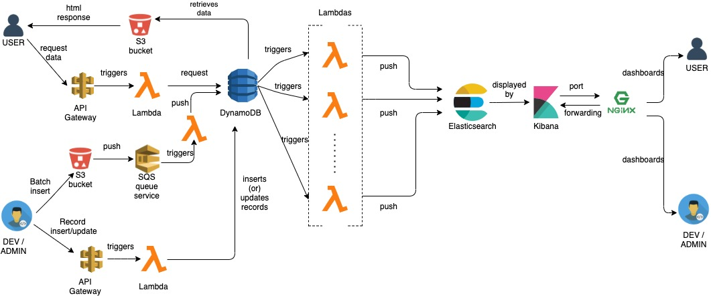

# API Interface for Analytics on IMDB Data

## CSCI 5253: Datacenter Scale Computing, CU Boulder

<b><u> Project Contributors: </u></b>
 - Abhinivesh Palusa
 - Nikhil Prabhu

<b><u> Project Goals: </u></b>

IMDB data doesn’t provide an official documented API. The main goal of our project is to create an API for describing shows (titles), describing people working in those shows, and providing analytics on already available data (sourced from IMDB interfaces website [1]) and also to update these analytics if either new data is inserted or existing data is updated.

<b><u> Software and Hardware Components: </u></b>

 - AWS Services:
    - S3 buckets
    - API Gateway
    - Serverless Lambda functions
    - SQS (Simple Queue Service)
    - DynamoDB 
    - EC2 instances
    - Cloudwatch logs
 - Elasticsearch
 - Kibana
 - Nginx 

<b><u> Architectural Diagram: </u></b>

<b><u> References: </u></b>

[1] https://datasets.imdbws.com/